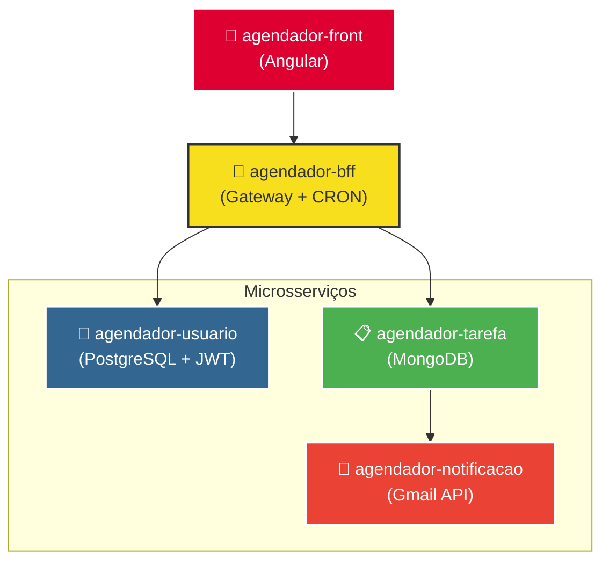
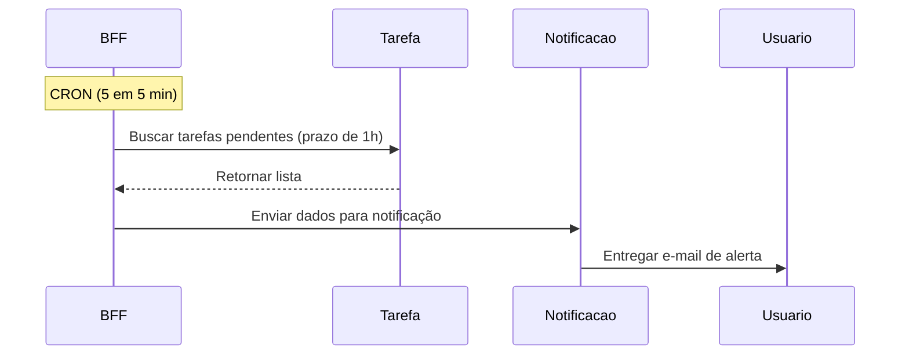

# 📬 Agendador — Serviço de Notificações

> Microsserviço responsável pelo envio de e-mails de notificação para tarefas próximas do vencimento, integrado ao ecossistema de agendamento de tarefas.

---

## 📌 Sobre o Projeto

Este serviço expõe um endpoint de envio de e-mail que é consumido pelo **CRON do BFF**. Quando o BFF identifica tarefas com vencimento dentro de 1 hora, ele chama este serviço passando os dados da tarefa, que monta um template de e-mail dinâmico e realiza o envio via **Gmail API**.

---

## 🏗️ Arquitetura do Ecossistema



### Fluxo completo da notificação



---

## 🚀 Tecnologias

| Tecnologia | Finalidade |
|---|---|
| Java 25 | Linguagem principal |
| Spring Boot 4.0.2 | Framework base |
| Gmail API | Envio de e-mails |
| Thymeleaf / Template dinâmico | Montagem do corpo do e-mail |
| SpringDoc / Swagger UI | Documentação e teste do endpoint |

---

## 📮 Endpoint

### `POST /email`

Envia um e-mail de notificação com os dados da tarefa.

**Uso principal:** chamado pelo CRON do BFF quando uma tarefa está a 1 hora do vencimento.

**Uso secundário:** pode ser testado manualmente via Swagger UI.

#### Request Body — `EmailDto`

```json
{
  "email": "usuario@gmail.com",
  "nomeTarefa": "Reunião de alinhamento",
  "descricao": "Reunião com o time de produto",
  "dataEvento": "25-05-2026 14:30:00"
}
```

| Campo | Tipo | Formato | Descrição |
|---|---|---|---|
| `email` | `String` | e-mail válido | Destinatário do e-mail |
| `nomeTarefa` | `String` | — | Nome da tarefa cadastrada |
| `descricao` | `String` | — | Descrição da tarefa |
| `dataEvento` | `OffsetDateTime` | `dd-MM-yyyy HH:mm:ss` (recebido em UTC; convertido para America/Sao_Paulo no corpo do e-mail) | Data e hora do evento |

> ⚠️ O campo `email` deve ser um endereço válido — o envio é realizado diretamente pelo Gmail.

#### Responses

| Status | Descrição |
|---|---|
| `200 OK` | E-mail enviado com sucesso |
| `500 Internal Server Error` | Falha no envio via Gmail API |

---

## 📖 Testando via Swagger

Com a aplicação em execução, acesse:

```
http://localhost:8083/swagger-ui.html
```

O Swagger já exibe o modelo do `EmailDto` no **Try it out**, basta preencher os campos e executar.

---

## 🔧 Como Executar

> As credenciais do Gmail já estão configuradas na imagem Docker — nenhuma variável de ambiente precisa ser setada. O envio é feito a partir de um e-mail reservado para este projeto (`andre.teste.notificacao@gmail.com`).

**Opção 1 — Ecossistema completo (recomendado)**

A forma mais simples é subir todos os serviços de uma vez pelo repositório [agendador-hub](https://github.com/AndreLuizDSM/agendador-hub):

```bash
git clone https://github.com/AndreLuizDSM/agendador-hub.git
cd agendador-hub
docker-compose up
```

**Opção 2 — Apenas este serviço**

```bash
docker pull aominedk/notificacao-service:latest
docker run -p 8082:8082 aominedk/notificacao-service:latest
```

Acesse o Swagger em `http://localhost:8083/swagger-ui.html` para testar o endpoint manualmente.

---

## 📂 Outros Serviços do Ecossistema

| Serviço | Descrição |
|---|---|
| [agendador-bff](../agendador-bff) | Gateway com CRON que consome este serviço |
| [agendador-tarefa](../agendador-tarefa) | CRUD de tarefas com MongoDB |
| [agendador-usuario](../agendador-usuario) | CRUD de usuários com autenticação JWT |
| [agendador-front](../agendador-front) | Interface Angular |

---

## 🧠 Decisões Técnicas

**Por que o CRON está no BFF e não aqui?**
Centralizar o agendamento no BFF mantém este serviço com responsabilidade única — apenas enviar e-mails quando solicitado. O BFF faz a lógica de negócio (buscar tarefas, filtrar por período, decidir quem notificar), enquanto este serviço só executa o envio.
